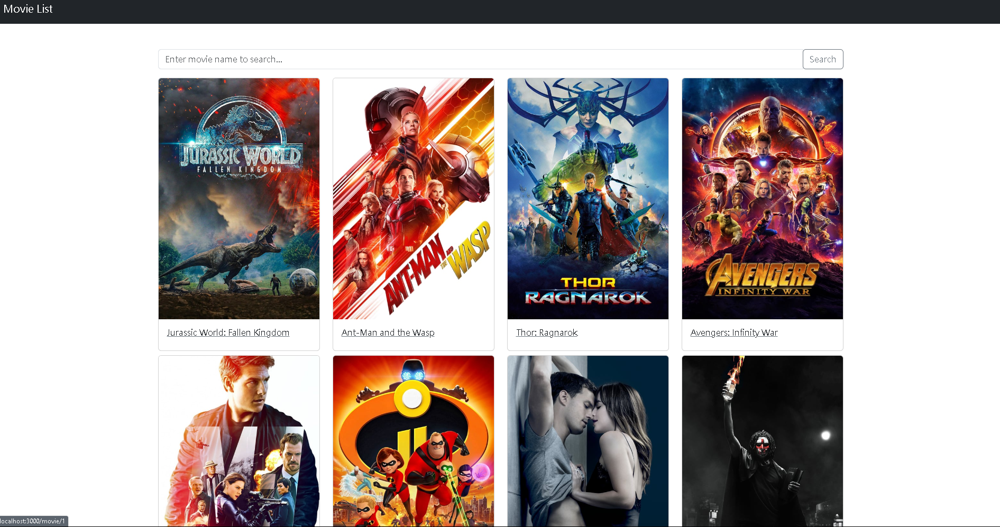
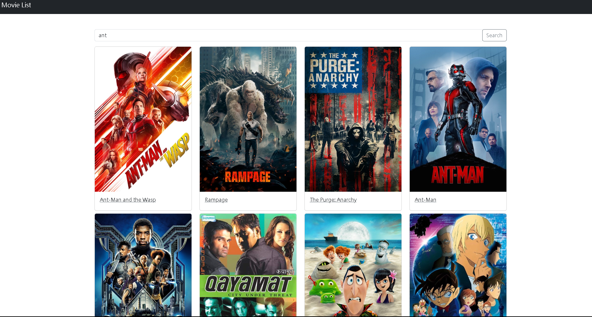

# 電影展示清單頁面
透過Node.js與Express所建置而成的電影清單網頁，能夠在這網頁上，找尋您有興趣的項目，甚至也可以進行關鍵字直接搜尋，減少花費時間。

## 專案安裝流程
1.開啟終端機(Terminal)，執行clone指令，將專案放置在本機端
```
git clone https://github.com/FrancisCKY/Movies.git
```
2.開啟終端機(Terminal)，進入放置此專案資料夾，並安裝相關套件
```
cd Movies //移動至該資料夾
```
```
npm install //安裝套件
```
3.開啟終端機(Terminal)安裝nodemon套件
```
nodemon app.js
```
4.開啟執行程式
```
npm run dev
```
若終端機出現'express server is running on http://localhost:3000
'，代表啟動完成，請至''http://localhost:3000''網頁開始使用




## 使用工具
- Visual Studio Code - 開發環境
- Express - 應用程式架構
- Express-Handlebars - 模板引擎
  
## 專案開發人員
> Francis Chen